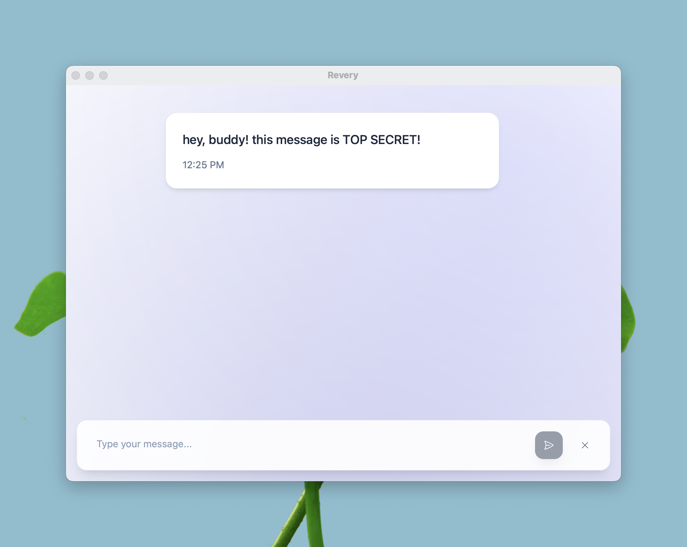

<div align="center">
  

  <h4>Conversations that never happened.<h4>


</div>

Revery is for when you need to talk, but can't afford for anyone to prove you did. Think old spy movies - secure conversations that leave no trace, no evidence, no "smoking gun" in a device seizure.



---

## How it works

### No identity, no history

- No contacts, no accounts, no persistent anything
- Each conversation starts from scratch
- When it ends, it's like it never existed

### Perfect deniability

- Share a secret phrase in person
- Later, connect over temporary Tor hidden services
- Same encryption key can create "alternative facts" - impossible to prove which conversation really happened

### Built for paranoia

- Messages encrypted with ChaCha20
- Authentication via SPAKE2 (no secret revealed)
- Everything disappears when you close the app

---

## Try it out

```bash
just run dev
```

- Enter your passphrase and click **Host** to create a session
- Share the generated onion address with your contact
- They enter the address and passphrase to join

Share the onion address however you want - Signal, email, carrier pigeon. Without the secret phrase, it's useless.

---

**EXPERIMENTAL SOFTWARE**: This has not undergone professional security audit. Suitable for research and testing only. Do not use for high-stakes communications.

---

_"The best conversations happen in rooms with no windows, no doors, and no memory."_

**License:** Apache 2.0 or MIT
